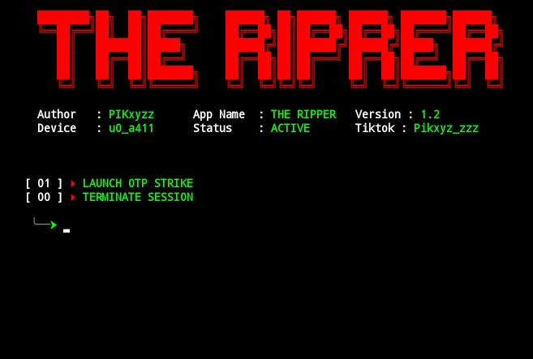

<p align="center">
  
</p>

<p align="center">
  
  
  
</p>

<h1 align="center">☠️ THE REAPER v3.0</h1>
<p align="center"><i>"OP Tools! THE REAPER."</i></p>

---

## 🩸 Apa Itu THE REAPER?

The Reaper adalah tools termux yang dikembangkan untuk spam otp 
---

## 🕯️ Fitur Kegelapan

| 🩸 | Deskripsi |
|----|-----------|
| ⚰️ | **17 otp **  |
| 📱 | **UI Responsif** — diperuntukkan bagi layar sempit Termux |
| 🔐 | **Encrypt Proteksi** — mereka yang mencoba membongkar akan tersesat |
| 🧠 | **Session Lock** — tak ada dua Reaper yang boleh berkeliaran |
| 👿 | **Auto Countdown** — waktu tunggu sebelum serangan berikutnya |

---

## ⚰️ Instalasi

```bash
pkg update && pkg upgrade
pkg install git python nano -y
pip install requests urllib3 flask
git clone https://github.com/pikxyzz2/SpamOtp
cd SpamOtp
make run
