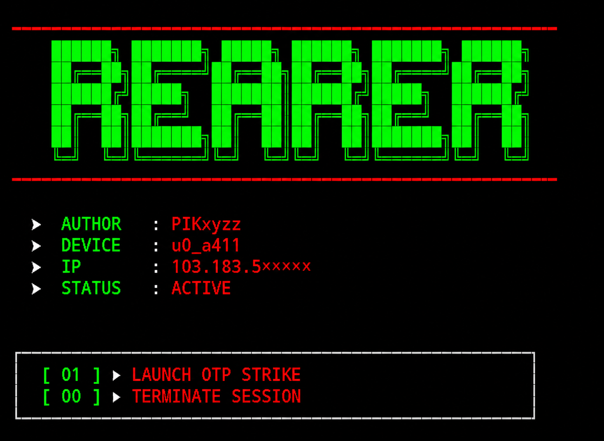

<p align="center">
  
</p>

<p align="center">
  
  
  
</p>

<h1 align="center">☠️ THE REAPER v3.0</h1>
<p align="center"><i>"Siapa bilang tools OTP harus ribet? THE REAPER datang untuk menghancurkan batasan."</i></p>

---

## 🚀 Apa Itu THE REAPER?

THE REAPER adalah **OTP Spam Engine** berbasis Python untuk Termux/Android.  
Dengan **10+ API terintegrasi**

---

## ✨ Fitur Unggulan

| 🛠️ | Deskripsi |
|----|-----------|
| ⚡ | **10+ API Aktif** (Pinhome, Tokopedia, Halodoc, Kredit Pintar, dll.) |
| 🔒 | **Verifikasi ID via JSONBin** (tambah/hapus user real-time) |
| 🛡️ | **Admin Panel** (kelola user dengan mudah) |
| 📱 | **UI Responsif** (dioptimalkan untuk layar HP Termux) |
| 🔐 | **Encrypt Proteksi** (XOR + Zlib + Double Base64) |
| 🧠 | **Session Lock** (mencegah multi-sesi) |
| ⏳ | **Auto Countdown** (jeda spam otomatis) |

---

## 📦 Instalasi

```bash
pkg update && pkg upgrade
pkg install python
pip install requests
git clone https://github.com/pikxyzz2010-dotcom/SpamOtp
cd SpamOtp
chmod +x TheReaper.py
