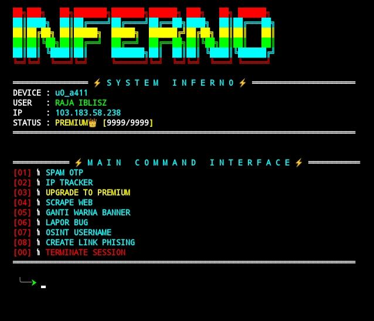

<p align="center">
  
</p>

# 🔥 INFERNO-X

> **A modular all-in-one offensive toolkit designed for Termux.  
> Clean UI. Brutal performance. Built for the shadows.**

---

## ⚡ Features

- **OTP Spammer** — Multi-endpoint payload delivery with adaptive delay & retry mechanism.
- **OSINT Username Scanner** — Check username availability across 20+ platforms in seconds.
- **Phishing Engine (X-PHISHER)** — Pre-integrated, battle-tested phishing module (auto-downloads on first use).
- **IP Tracker** — Geolocation and ISP info retrieval.
- **Web Scraper** — Lightweight website content fetcher.
- **Custom UI Themes** — Choose between **Mixed** (Cyan, Green, Gold, Red) or **Pure** (Red, Cyan, Green, White, Gold) color schemes.

---

## 🚀 Quick Install

```bash
# 1. Clone the repository
git clone https://github.com/pikxyzz2010-dotcom/SpamOtp.git

# 2. Enter the directory
cd SpamOtp

# 3. Run the launcher
make run
```


ℹ️ The launcher automatically detects your Python version and fixes compatibility issues (Python 3.14 → 3.13).


🎮 Usage

```
[01] Spam OTP
[02] IP Tracker
[03] Upgrade to Premium
[04] Scrape Web
[05] Change Color Theme
[06] Report Bug
[07] OSINT Username Scanner
[08] Create Link Phishing (X-PHISHER)
[00] Terminate Session

---

🎨 Theming

Change the UI look anytime via menu [05].

· Pure Mode — One solid color (Red, Cyan, Green, White, Gold).
· Mixed Mode — Dynamic cyberpunk color combinations.

---

---

🧰 Requirements

All dependencies are handled automatically by run.py.
Just make sure you have a working Termux environment with internet access.

---

⚠️ Disclaimer

This tool is developed for educational purposes and authorized penetration testing only.
The author assumes no responsibility for any misuse or illegal activities performed using this toolkit.

---

📬 Contact

· Author : Pikyxyz
· GitHub : @pikxyzz2010-dotcom

---

INFERNO-X — Execute. Evade. Dominate.

```

---
